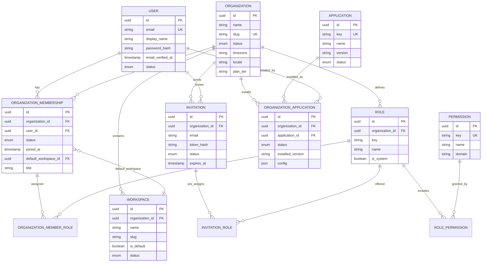

# HEOS Organization Domain Model

**Milestone:** M3 — Identity, Organizations & Multi-Tenancy  
**Status:** Approved architectural blueprint  
**Author:** HE-ARCH-001 (Chief Software Architect)

This document is the canonical reference for the HEOS Organization bounded context. All future identity, tenancy, workspace, application, and authorization work must conform to this model unless superseded by a revised ADR.

---

## 1. Scope

HEOS is a Business Operating System — one platform hosting many industry suites. M3 establishes:

| Concern | Entity |
|---------|--------|
| Platform identity | `User` |
| Tenant boundary | `Organization` |
| Operational context | `Workspace` |
| App enablement | `Application` + `OrganizationApplication` |
| Authorization | `Role`, `Permission`, junction tables |
| Onboarding | `Invitation` |

The UI `WorkspaceShell` is presentation chrome. The domain `Workspace` is a tenant-scoped operational partition.

---

## 2. Architectural decisions

| # | Decision | Rationale |
|---|----------|-----------|
| 1 | **Organization is the tenant root** | Billing, isolation, app installs, and RBAC belong to an enterprise customer. |
| 2 | **Global User + OrganizationMembership** | One identity across multiple organizations (requirement). |
| 3 | **Workspace as org subdivision** | Departments, properties, or units without separate tenants. Default workspace provisioned at org creation. |
| 4 | **Application catalog vs installation** | Global `Application` catalog; per-tenant `OrganizationApplication` installs. |
| 5 | **Global permissions, org-scoped roles** | Stable permission vocabulary; tenant-customizable roles. |
| 6 | **Shared schema, row-level tenancy** | `organization_id` on all tenant data; simplest M3 path, upgradeable later. |
| 7 | **UUID v7 primary keys** | Globally unique, time-ordered, no sequential leakage. |
| 8 | **Standard audit mixin** | Enterprise compliance and forensics from day one. |
| 9 | **Soft delete on business entities** | Catalogs use `status` flags instead of soft delete. |
| 10 | **Invitation as first-class entity** | Pending state, expiry, role pre-assignment, audit trail. |

---

## 3. Bounded contexts

```mermaid
flowchart LR
  subgraph Identity["Identity Context"]
    User
  end

  subgraph Organization["Organization Context (M3)"]
    Organization
    Workspace
    OrganizationMembership
    Invitation
    Role
    OrganizationApplication
  end

  subgraph Platform["Platform Catalog Context"]
    Application
    Permission
  end

  subgraph Authorization["Authorization"]
    RolePermission
    OrganizationMemberRole
  end

  User --> OrganizationMembership
  Organization --> Workspace
  Organization --> OrganizationMembership
  Organization --> Invitation
  Organization --> Role
  Organization --> OrganizationApplication
  Application --> OrganizationApplication
  Role --> RolePermission
  Permission --> RolePermission
  OrganizationMembership --> OrganizationMemberRole
  Role --> OrganizationMemberRole
  Invitation -.->|accepts into| OrganizationMembership
```

### Aggregate roots

| Aggregate | Entities | Invariants |
|-----------|----------|------------|
| **User** | User | Email unique globally |
| **Organization** | Organization, Workspace, OrganizationMembership, Invitation, Role, OrganizationApplication | ≥1 workspace; ≥1 active Owner membership; slug unique globally |
| **Application** | Application | Key immutable after publish |
| **Permission** | Permission | Key immutable |

---

## 4. Entity Relationship Diagram



---

## 5. Database tables

Logical schema — map types to your RDBMS. All PKs are UUID v7 unless noted.

### 5.1 Audit mixin

**Full audit (+soft delete):** `created_at`, `created_by_user_id`, `updated_at`, `updated_by_user_id`, `deleted_at`, `deleted_by_user_id`

**Audit only:** `created_at`, `created_by_user_id`, `updated_at`, `updated_by_user_id`

### 5.2 `users` (+audit, +soft)

| Column | Type | Notes |
|--------|------|-------|
| `id` | uuid | PK |
| `email` | varchar(320) | UNIQUE, NOT NULL |
| `display_name` | varchar(255) | NOT NULL |
| `password_hash` | varchar(255) | NULL (SSO-only users) |
| `email_verified_at` | timestamptz | NULL |
| `status` | enum | `active`, `suspended`, `deactivated` |

### 5.3 `organizations` (+audit, +soft)

| Column | Type | Notes |
|--------|------|-------|
| `id` | uuid | PK |
| `name` | varchar(255) | NOT NULL |
| `slug` | varchar(63) | UNIQUE, NOT NULL |
| `status` | enum | `provisioning`, `active`, `suspended`, `archived` |
| `timezone` | varchar(64) | default `UTC` |
| `locale` | varchar(16) | default `en` |
| `plan_tier` | varchar(64) | default `standard` |

### 5.4 `workspaces` (+audit, +soft)

| Column | Type | Notes |
|--------|------|-------|
| `id` | uuid | PK |
| `organization_id` | uuid | FK → organizations |
| `name` | varchar(255) | NOT NULL |
| `slug` | varchar(63) | UNIQUE per org |
| `is_default` | boolean | exactly one true per org |
| `status` | enum | `active`, `archived` |

### 5.5 `organization_memberships` (+audit, +soft)

| Column | Type | Notes |
|--------|------|-------|
| `id` | uuid | PK |
| `organization_id` | uuid | FK → organizations |
| `user_id` | uuid | FK → users |
| `status` | enum | `pending`, `active`, `suspended`, `removed` |
| `joined_at` | timestamptz | NULL |
| `default_workspace_id` | uuid | FK → workspaces, NULL |
| `title` | varchar(255) | NULL |

**Unique:** `(organization_id, user_id)` WHERE `deleted_at IS NULL`

### 5.6 `applications` (+audit)

| Column | Type | Notes |
|--------|------|-------|
| `id` | uuid | PK |
| `key` | varchar(128) | UNIQUE, immutable |
| `name` | varchar(255) | NOT NULL |
| `description` | text | NULL |
| `version` | varchar(32) | NOT NULL |
| `status` | enum | `active`, `deprecated`, `retired` |

### 5.7 `organization_applications` (+audit, +soft)

| Column | Type | Notes |
|--------|------|-------|
| `id` | uuid | PK |
| `organization_id` | uuid | FK → organizations |
| `application_id` | uuid | FK → applications |
| `status` | enum | `installing`, `active`, `disabled`, `uninstalled` |
| `installed_version` | varchar(32) | NOT NULL |
| `config` | json | default `{}` |
| `installed_at` | timestamptz | NULL |
| `installed_by_user_id` | uuid | FK → users |

**Unique:** `(organization_id, application_id)` WHERE `deleted_at IS NULL`

### 5.8 `permissions` (+audit)

| Column | Type | Notes |
|--------|------|-------|
| `id` | uuid | PK |
| `key` | varchar(128) | UNIQUE, immutable |
| `name` | varchar(255) | NOT NULL |
| `description` | text | NULL |
| `domain` | varchar(64) | NOT NULL |

### 5.9 `roles` (+audit, +soft)

| Column | Type | Notes |
|--------|------|-------|
| `id` | uuid | PK |
| `organization_id` | uuid | FK → organizations; NULL = platform role |
| `key` | varchar(64) | UNIQUE per org |
| `name` | varchar(255) | NOT NULL |
| `description` | text | NULL |
| `is_system` | boolean | seeded roles: owner, admin, member, viewer |

### 5.10 `role_permissions`

| Column | Type | Notes |
|--------|------|-------|
| `role_id` | uuid | PK, FK → roles |
| `permission_id` | uuid | PK, FK → permissions |
| `created_at` | timestamptz | NOT NULL |
| `created_by_user_id` | uuid | NULL |

### 5.11 `organization_member_roles`

| Column | Type | Notes |
|--------|------|-------|
| `id` | uuid | PK |
| `organization_membership_id` | uuid | FK → organization_memberships |
| `role_id` | uuid | FK → roles (same org) |
| `created_at` | timestamptz | NOT NULL |
| `created_by_user_id` | uuid | NULL |
| `updated_at` | timestamptz | NOT NULL |
| `updated_by_user_id` | uuid | NULL |

**Unique:** `(organization_membership_id, role_id)`

### 5.12 `invitations` (+audit, +soft)

| Column | Type | Notes |
|--------|------|-------|
| `id` | uuid | PK |
| `organization_id` | uuid | FK → organizations |
| `email` | varchar(320) | NOT NULL |
| `invited_by_user_id` | uuid | FK → users |
| `token_hash` | varchar(255) | NOT NULL (never store plain token) |
| `status` | enum | `pending`, `accepted`, `expired`, `revoked` |
| `expires_at` | timestamptz | NOT NULL |
| `accepted_at` | timestamptz | NULL |
| `accepted_by_user_id` | uuid | FK → users, NULL |
| `message` | text | NULL |

### 5.13 `invitation_roles`

| Column | Type | Notes |
|--------|------|-------|
| `invitation_id` | uuid | PK, FK → invitations |
| `role_id` | uuid | PK, FK → roles |
| `created_at` | timestamptz | NOT NULL |
| `created_by_user_id` | uuid | NULL |

---

## 6. UUID strategy

| Rule | Detail |
|------|--------|
| Format | UUID v7 (RFC 9562), time-ordered |
| PK | All entities use `id` as UUID v7 |
| APIs | Expose `id` directly; no dual public ID in v1 |
| Natural keys | `slug`, `email`, `application.key`, `permission.key` — unique indexes only |
| Invitation tokens | Random token; store `token_hash` only |

---

## 7. Soft delete strategy

| Entity | Strategy |
|--------|----------|
| User, Organization, Workspace, OrganizationMembership, Role, OrganizationApplication, Invitation | Soft delete via `deleted_at` |
| Application, Permission | No soft delete — use `status = deprecated/retired` |
| Junction tables | Hard delete or create-only audit |

**Default query rule:** `WHERE deleted_at IS NULL` unless explicitly archival.

---

## 8. Multi-tenancy

### Tenant context (runtime)

```
TenantContext {
  organization_id: UUID      // required for tenant operations
  workspace_id: UUID         // optional; defaults from membership
  membership_id: UUID        // caller's OrganizationMembership
  user_id: UUID
}
```

### Data classification

| Class | Examples | Filter |
|-------|----------|--------|
| Global | users, applications, permissions | None |
| Tenant | organizations, roles, memberships, invitations, org_apps | `organization_id` |
| Workspace-scoped (future) | Business app data | `organization_id` + `workspace_id` |

### Organization provisioning

1. Insert `organization` (status = `provisioning`)
2. Insert default `workspace` (`is_default = true`)
3. Seed system roles: `owner`, `admin`, `member`, `viewer`
4. Create `organization_membership` for creator (status = `active`)
5. Assign `owner` role
6. Set organization status = `active`

---

## 9. M3 permission vocabulary

| Permission key | Domain |
|----------------|--------|
| `organization.read` | organization |
| `organization.update` | organization |
| `organization.archive` | organization |
| `members.read` | organization |
| `members.invite` | organization |
| `members.update` | organization |
| `members.remove` | organization |
| `roles.read` | organization |
| `roles.manage` | organization |
| `workspace.read` | workspace |
| `workspace.create` | workspace |
| `workspace.update` | workspace |
| `workspace.archive` | workspace |
| `applications.read` | application |
| `applications.install` | application |
| `applications.configure` | application |
| `applications.uninstall` | application |

### Default role mapping

| Role | Permissions |
|------|-------------|
| `owner` | All |
| `admin` | All except `organization.archive` |
| `member` | `organization.read`, `workspace.read`, `applications.read` |
| `viewer` | Read-only subset |

---

## 10. Out of scope (future milestones)

- SSO / OAuth provider tables
- Billing & subscription entities
- API keys / service accounts
- Immutable audit event log
- DB-level row security policies
- Cross-org data sharing

---

## 11. Revision history

| Date | Version | Change |
|------|---------|--------|
| 2026-06-23 | 1.0 | Initial approved blueprint (M3) |
